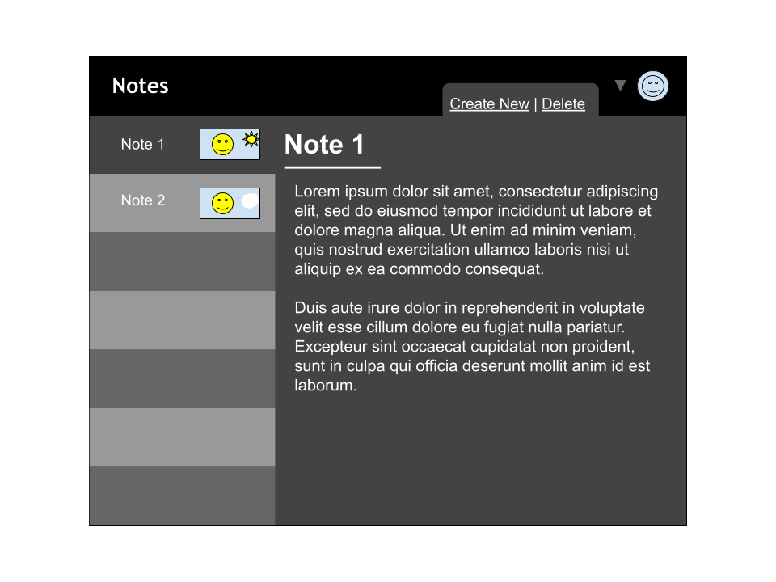
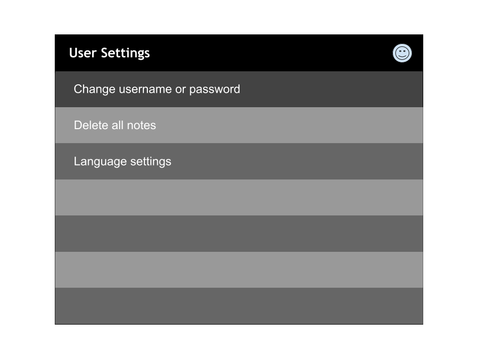

# Functional Requirements
1. The user should be able to create a profile.
2. The user should be able to edit their profile
3. The user must be able to log in to their account
4. The application must be able to generate images as covers for individual notes using Together API
5. The user should be able to create a note.
6. The user should be able to edit a note.
7. The user should be able to edit a note.
8. The user should be able to search up notes.
9. The user should be able to share notes with other users.
10. The user should be able to lock notes with a passcode.
11. The user should be able to filter notes by tags.
12. The user should be able to delete their profile
13. The user should be able to request to convert the note to pdf and download
14. The user should be able to create checklist in each note

# UI Mockup

# Non-functional Requirements
1. The website must work on Google Chrome
2. Multilingual support

# Use Case Descriptions

## Requirement 1
Name: The user should be able to create a profile

Actors: User, Website

Precondition: The user does not have an account and is at the landing page of the website

Trigger: The user clicks on “Create Account” button

Primary Sequence:
1. Website redirects to the user to a form to create a new account
2. The user inputs all necessary information
3. The user clicks on the “Create Account” button
4. The website creates the user and stores them in the database
5. The user is redirected to to the landing page and is able to log in

Primary Postconditions:
- The user has created a new account that is stored in the website’s database

Alternative Sequence:
1. (after 3 in primary) If the user already has an account with the same email, the website displays an error message that an account has already been created with the same email.

Alternative Postconditions:
- A new account is not created

## Requirement 2

Name: The user should be able to edit their profile

Actors: User, Website

Precondition: The user is logged in to their account and has navigated to the profile section.

Trigger: The user clicks “Edit Account Information”

Primary Sequence:
1. The website redirects the user to a page where they can edit all the information on their account (they are unable to edit their email address)
2. The user makes changes to their account information.
3. The user clicks “Apply Changes” button
4. The website updates the user’s information in the database and then redirects the user back to the profile section

Primary Postconditions:
- The user’s account information has been updated

Alternative Sequence:
1. (after 2 in primary) If the user instead selects the “Discard Changes” button, then the website doesn’t make any updates and redirects the user back to the profile section.

Alternative Postconditions:
- The user’s account is not updated

## Requirement 3
Name: The user must be able to log in to their account

Actors: User, Website

Precondition: The user has already created an account on the website.

Trigger: The user has navigated to the landing page and is not logged in.

Primary Sequence:
1. The user inputs their email address and password into the email address and passwords field correctly
2. The user clicks on the “LogIn” button
3. The website checks the email address and password and sees that it is a valid account, it then logs the user in and redirects the user to the home page.

Primary Postconditions:
- The user has been logged into their account

Alternative Sequence:
1. (after 2 in primary) The information entered in either the email address field or password field is invalid
2. The website checks and sees that the information is invalid.
3. The website displays an error message that the information is invalid.

Alternative Postconditions:
- The user is not logged in

## Requirement 4

Name: The application must be able to generate images as covers for individual notes using Together API

Actors: User, Website

Precondition: The user has already registered an account, is logged in, and has created a note with text inside of it.

Trigger: The user clicks on the “Generate Cover” button when editing a note.

Primary Sequence:
1. The website takes all the text on the note and then generates and generates an image related to some of the information in the text.
2. The note should now have a new image next to it’s name in the notes gallery

Primary Postconditions
- The user has successfully generated a cover image for the note.

Alternative Sequence:
1. (at 1 in primary) The note has no text on it
2. The website displays an error message that no image can be generated without any text for context.

Alternative Postconditions:
- The note has no new cover image.

## Requirement 5

Name: Create a note

Summary: a user who has logged in can select the option to create a note

Actors: The users/customers that are creating a note.

Preconditions: The customer has logged in 

Trigger: customer/user selects  “create a note”

Primary Sequence:
1. Systems prompts user to main page and displays create a note section
2. customer/user selects “create a note”
3. Systems opens create note section and displays it
4. User confirms their intent create the note
5. Systems displays that note is created
6. Customer is satisfied and can sign out

Alternative Sequence
- The customer cannot create a note and displays an error message. 

Post-conditions
- Customer is able to create a note and view it

## Requirement 6

Name: Edit a note

Summary: A customer/user who has logged in can view the note and edit it.

Actors: The customer/User

Precondition: The customer has logged in

Trigger: Customer selects the option to “edit note” option.

Primary Sequence: 
1. System prompts user to main page and displays option to edit note
2. Customer/User Selects option to edit note
3. Systems displays list of existing notes 
4. Customer can scroll and chose which note they want to edit
5. Customer clicks which note they want to edit
6. Customer is satisfied and can submit

Alternative Sequence
- if the user decides not to edit the note then the system displays to cancel editing without any changes being made.

Post-conditions
- the note that's been selected for editing is updated with the changes.
- the changes can be viewed when selecting the note

## Requirement 7

Name: Delete a note 

Summary: A customer/user who has logged in can delete a note

Actors: The customer/User

Precondition: The customer has logged in 

Trigger: Customer selects the option to “delete note” option.

Primary Sequence: 
1. System prompts user to main page and displays option to delete note
2. Systems displays list of existing notes
3. customer/user selects option to delete note
4. The customer/user selects the note they want to delete
5. Customer/user deletes note
6. customer/user is satisfied and can sign out

Alternative Sequence
- if the user decides not to delete the note then the system displays the option to cancel without deleting any notes.

Post-conditions
- The selected note that was chosen is deleted and cannot be seen in the list of notes.

## Requirement 8

Name: Search up notes

Summary: a user who has logged in can select the option to search for notes

Actors: Customer/User

Precondition: The customer has logged in

Trigger: Customer selects the option to “search up notes”.

Primary Sequence:
1. System prompts user to main page and displays option to search up specific note
2. Systems provides a search field
3. The customer/user enters keyword for what they want to search for
4. Systems prompts a list of notes that match those keywords
5. The customer/ user can view the notes they searched and chose one
The customer is satisfied and can sign out

Alternative Sequence
- if the initial search does not show any option of notes with those keywords the system should display an error with “no note found”.

Post-conditions
- The customer/user can view the content in which they searched for. 

## Requirement 9
Name: The user should be able to share notes with other users

Actors: A user which is logged in.

Precondition: The user has a preexisting account on the website and is logged in. The user has created at least one note.

Trigger: The user clicks on the note they wish to share, then presses the "Share" icon.

Primary Sequence:
1. System prompts user to search the username of a pre-existing user to share the note with.
2. User enters in the username of the user.
3. User presses the "Share note" button, and the note is now shared with the user entered previously.

Primary Postconditions
- The user's selected note is shared with the entered user; the entered user now has access to the shared note.

Alternative Sequence:   
The user has already shared the note with the entered user:
1. An error occurs, and a prompt is shown warning that the entered user already has access to the current note.

The user enters in an invalid username (username does not exist in the database):
1. User is prompted that the username entered does not exist.
1. User is prompted to enter a valid username.

The user is attempting to share a locked note:
1. User will be prompted to ensure that they wish to share the locked note.
1. User can select to proceed with sharing the note or to cancel.

Alternative Postconditions
- The note is not shared.

## Requirement 10
Name: The user should be able to lock notes with a passcode.

Actors: A user which is logged in.

Precondition: The user has a preexisting account on the website and is logged in. The user has created at least one note.

Trigger: The user selects the note to lock, then presses the note settings icon. From there, the user selects the option "Lock note".

Primary Sequence:
1. User enters a passcode for the note.
2. User presses the "submit" button.
3. User is prompted with a warning: "Are you sure you wish to lock this note?"
4. User presses "Yes" to proceed locking the selected note.

Primary Postconditions
- The user's selected note is now locked with a passcode.

Alternative Sequence
The user presses "No" when prompted:
1. User is returned to the selected note's settings view.

Alternative Postconditions
- The note is not locked.

## Requirement 11

Name: The user should be able to filter notes by tags.

Actors: A user which is logged in.

Precondition: The user has a preexisting account on the website and is logged in. The user has created customized tags.

Trigger: The user selects the "Filter by tag" option next to the search bar. 

Primary Sequence:
1. In a drop down menu, all user-created tags appear.
2. User selects one or more tags to filter notes by.
3. A list of notes with matching tags appear for the user to select.

Primary Postconditions
- Notes with tags matching the selected tags appear for the user to select.

Alternative Sequence
1. The user has not created any tags:
2. User must select the "Create new tag" button.
3. The user must enter the name of the tag.
4. The user presses "Submit".
5. Once the user attempts to filter by tag again, the newly created tag will appear in the dropdown menu.

Alternative Postconditions
- All notes appear on the screen when searching without filtering by tag or title (when no tags exist, filtering by tag will default to viewing the full list of notes).

## Requirement 12
Name: User should be able to delete the profile

Actors: User that login into the page and website

Precondition: Option for the user who wishes to delete the account if no longer used

Trigger: The user selects the option “Delete Account” in the main menu

Primary Sequence:

1. When user clicks into the the user profile, the system prompts the option for the user with the icon “Delete Account”
2. After user click “Delete Account,” system will prompt the window display the selection of why user want to delete the account
3. After the selection, the system will prompt another window to ask if user is sure to delete the account or not
4. If user select yes, then it will prompt the window that delete successfully and return to login page

Alternate Sequence: 
- During the selection of the reason of delete the user, if user decide not to delete, there will be an option “No Delete Account,” the system will bring user back to the main page.

Alternate Postcondition:
-The account will not be deleted and return to user profile page

Primary Postcondition:
-  After delete the account, the system will prompt back to the login page for more option

## Requirement 13
Name: The user can convert to pdf and download the note

Actor: User that use the page and note

Precondition: User that wish to download the note to pdf to save into the local device

Trigger: The user select the option to download the file

Primary sequence:
1. On the note page on the tool bar, there will be an option called “Download” that allow user to download the note down
2. The system will prompt the windows display the window with the message that the file will be converted into PDF file. If the user agree, then click the option “Download” on the same window
3. After clicking the download option, system will prompt a new window that display the “The file is converted to PDF and downloading…”

Alternate Sequence:
- On step #2, if the user does not like to download the file into pdf file, there will be the option “Cancel” and return back to the main page.

Alternate Postcondition:
- The system will bring the user back to the note page

Primary Postcondition:
 After successfully download the file, the system will prompt the window with the message that “The file has been downloaded successfully

## Requirement 14

Name: The user should be able create checklist inside of the note

Actor: user that login into the page

Precondition: User need to create a checklist inside of the note

Trigger: User select the option “Create Checklist” in the tool box in the note

Primary Sequennce:
1. After user select the option the create the checklist, the system will prompt the checklist on the side of the note.
2. The system will let the user to type in the checklist by clicking into it.
3. If user finish typing on the checklist, on the side of the note will have the option “Done” to finalize the checklist and save it
4. If the user would like to add , delete or modify the checklist, user simply just select the checklist option and it will open up for user to see.

Alternate Sequence:
- During the edit of the checklist, if user no longer needed the checklist, there will be the “x” option on top right of the checklist to delete and turn off the checklist.

Alternate Postcondition
- The system will return back to the note page without the checklist

Primary Postcondition:
- After finalize the checklist and select “Done”, user is able to view the note and the checklist on the same page.

